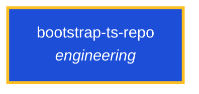

<!-- AUTO-GENERATED by scripts/generate-skills-graph.ts — do not edit by hand. -->
<!-- Regenerate with: npm run graph:update -->

> ⚠️ **AUTO-GENERATED — do not edit this file by hand.**
> Edits will be overwritten. To change the graph, edit the source `SKILL.md` files and run `npm run graph:update`.
> Source: `scripts/generate-skills-graph.ts` · Regenerate: `npm run graph:update`

# bootstrap-ts-repo

> **Category:** `engineering` · **Path:** `skills/engineering/bootstrap-ts-repo/SKILL.md`

Bootstrap a new TypeScript repository with native TS, tsdown, oxlint, biome, husky, and Nx. Use the current Node LTS as the minimum runtime, the latest supported versions for each major line, and avoi

## Stats

0 dependencies · 0 dependents

## Graph

Rendered with [Mermaid](https://mermaid.js.org/). On github.com click any node to zoom; drag to pan. If the diagram fails to load, regenerate locally with `npm run graph:update`.

