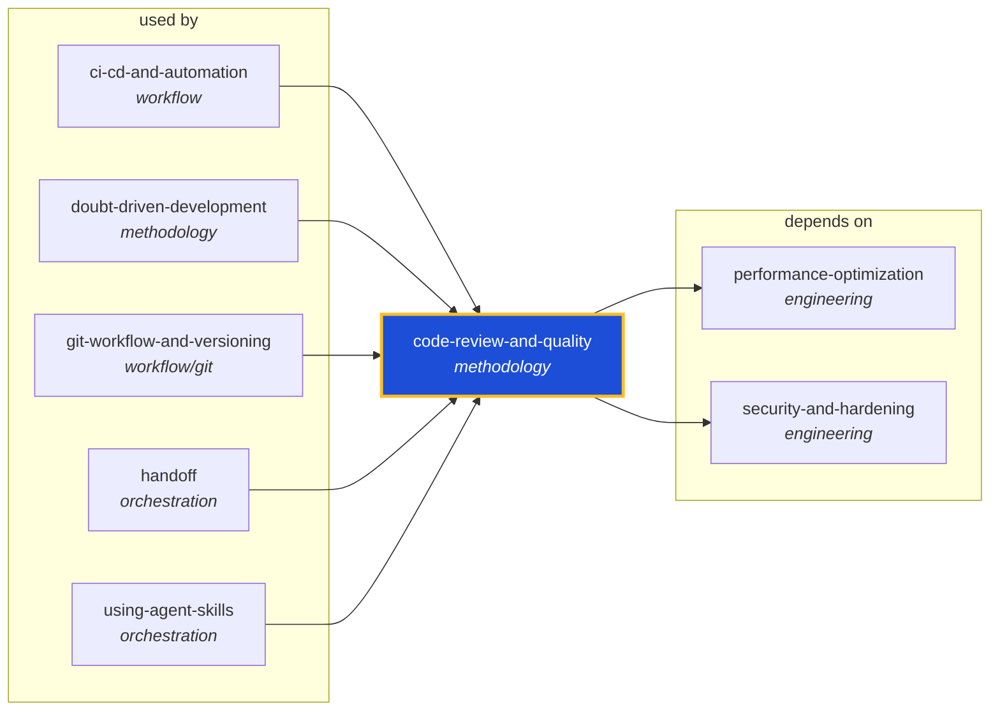

<!-- AUTO-GENERATED by scripts/generate-skills-graph.ts — do not edit by hand. -->
<!-- Regenerate with: npm run graph:update -->

> ⚠️ **AUTO-GENERATED — do not edit this file by hand.**
> Edits will be overwritten. To change the graph, edit the source `SKILL.md` files and run `npm run graph:update`.
> Source: `scripts/generate-skills-graph.ts` · Regenerate: `npm run graph:update`

# code-review-and-quality

> **Category:** `methodology` · **Path:** `skills/methodology/code-review-and-quality/SKILL.md`

Conducts multi-axis code review. Use before merging any change. Use when reviewing code written by yourself, another agent, or a human. Use when you need to assess code quality across multiple dimensi

## Stats

2 dependencies · 5 dependents

## Graph

Rendered with [Mermaid](https://mermaid.js.org/). On github.com click any node to zoom; drag to pan. If the diagram fails to load, regenerate locally with `npm run graph:update`.

