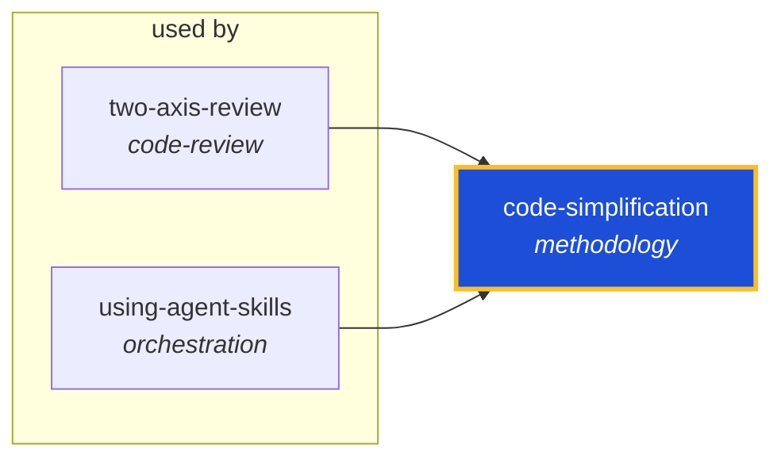

<!-- AUTO-GENERATED by scripts/generate-skills-graph.ts — do not edit by hand. -->
<!-- Regenerate with: npm run graph:update -->

> ⚠️ **AUTO-GENERATED — do not edit this file by hand.**
> Edits will be overwritten. To change the graph, edit the source `SKILL.md` files and run `npm run graph:update`.
> Source: `scripts/generate-skills-graph.ts` · Regenerate: `npm run graph:update`

# code-simplification

> **Category:** `methodology` · **Path:** `skills/methodology/code-simplification/SKILL.md`

Simplifies code for clarity. Use when refactoring code for clarity without changing behavior. Use when code works but is harder to read, maintain, or extend than it should be. Use when reviewing code

## Stats

0 dependencies · 2 dependents

## Graph

Rendered with [Mermaid](https://mermaid.js.org/). On github.com click any node to zoom; drag to pan. If the diagram fails to load, regenerate locally with `npm run graph:update`.

