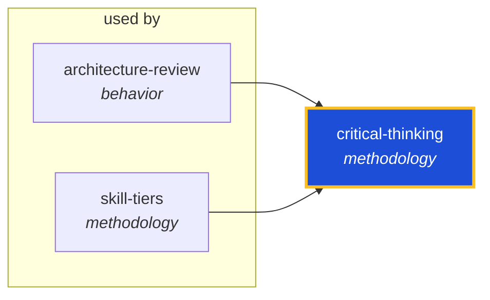

<!-- AUTO-GENERATED by scripts/generate-skills-graph.ts — do not edit by hand. -->
<!-- Regenerate with: npm run graph:update -->

> ⚠️ **AUTO-GENERATED — do not edit this file by hand.**
> Edits will be overwritten. To change the graph, edit the source `SKILL.md` files and run `npm run graph:update`.
> Source: `scripts/generate-skills-graph.ts` · Regenerate: `npm run graph:update`

# critical-thinking

> **Category:** `methodology` · **Path:** `skills/methodology/critical-thinking/SKILL.md`

Make the agent a rational, evidence-driven critic. Use when evaluating a user's architectural claim, idea, or pushback, or when a premise may be false. Covers sycophancy resistance, knowledge cutoffs,

## Stats

0 dependencies · 2 dependents

## Graph

Rendered with [Mermaid](https://mermaid.js.org/). On github.com click any node to zoom; drag to pan. If the diagram fails to load, regenerate locally with `npm run graph:update`.

