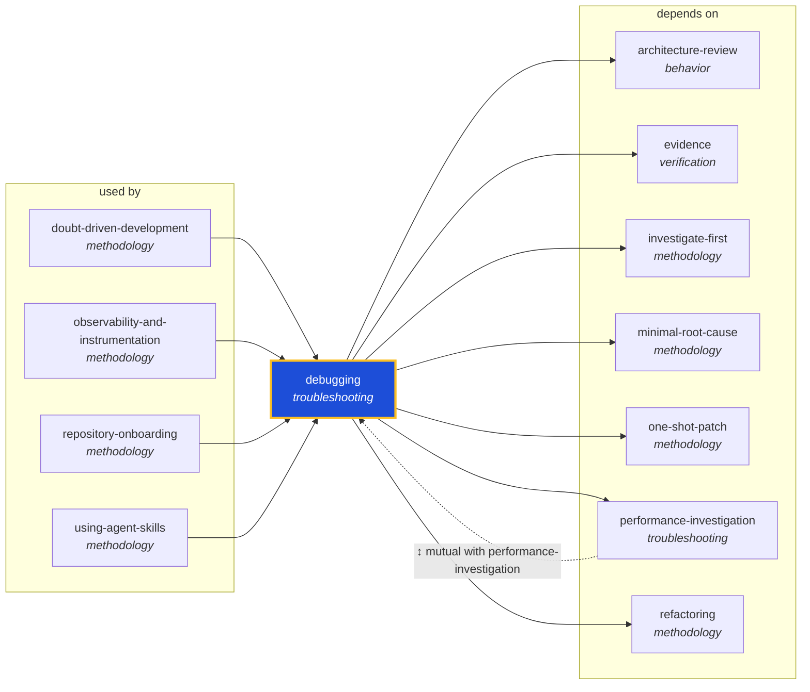

<!-- AUTO-GENERATED by scripts/generate-skills-graph.ts — do not edit by hand. -->
<!-- Regenerate with: npm run graph:update -->

> ⚠️ **AUTO-GENERATED — do not edit this file by hand.**
> Edits will be overwritten. To change the graph, edit the source `SKILL.md` files and run `npm run graph:update`.
> Source: `scripts/generate-skills-graph.ts` · Regenerate: `npm run graph:update`

# debugging

> **Category:** `troubleshooting` · **Path:** `skills/troubleshooting/debugging/SKILL.md`

Use when an agent is confronted with a runtime failure, wrong output, flaky behavior, regression, performance regression, or crash and needs a disciplined debugging loop. Covers the 4-phase Reproduce

## Stats

7 dependencies · 5 dependents

## Graph

Rendered with [Mermaid](https://mermaid.js.org/). On github.com click any node to zoom; drag to pan. If the diagram fails to load, regenerate locally with `npm run graph:update`.

