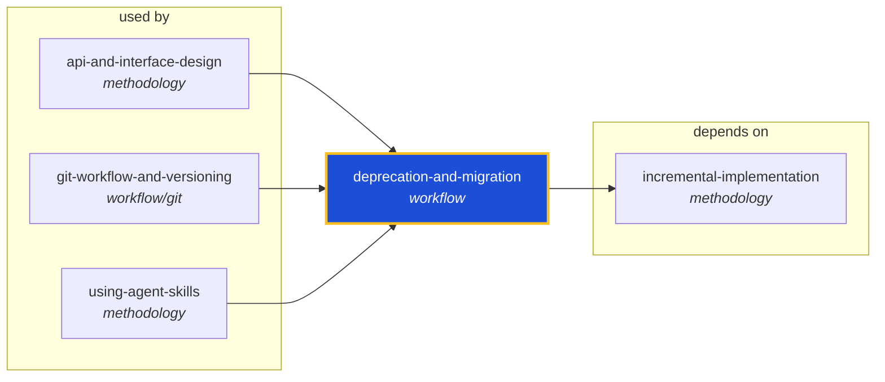

<!-- AUTO-GENERATED by scripts/generate-skills-graph.ts — do not edit by hand. -->
<!-- Regenerate with: npm run graph:update -->

> ⚠️ **AUTO-GENERATED — do not edit this file by hand.**
> Edits will be overwritten. To change the graph, edit the source `SKILL.md` files and run `npm run graph:update`.
> Source: `scripts/generate-skills-graph.ts` · Regenerate: `npm run graph:update`

# deprecation-and-migration

> **Category:** `workflow` · **Path:** `skills/workflow/deprecation-and-migration/SKILL.md`

Manages deprecation and migration. Use when removing old systems, APIs, or features. Use when migrating users from one implementation to another. Use when deciding whether to maintain or sunset existi

## Stats

1 dependencies · 3 dependents

## Graph

Rendered with [Mermaid](https://mermaid.js.org/). On github.com click any node to zoom; drag to pan. If the diagram fails to load, regenerate locally with `npm run graph:update`.

