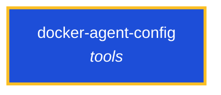

<!-- AUTO-GENERATED by scripts/generate-skills-graph.ts — do not edit by hand. -->
<!-- Regenerate with: npm run graph:update -->

> ⚠️ **AUTO-GENERATED — do not edit this file by hand.**
> Edits will be overwritten. To change the graph, edit the source `SKILL.md` files and run `npm run graph:update`.
> Source: `scripts/generate-skills-graph.ts` · Regenerate: `npm run graph:update`

# docker-agent-config

> **Category:** `tools` · **Path:** `skills/tools/docker-agent-config/SKILL.md`

Design, configure, and run multi-agent AI teams using the Docker Agent CLI plugin. Use when creating docker agent YAML/HCL configs, building sub-agent teams, or needing the schema for agents, models,

## Stats

0 dependencies · 0 dependents

## Graph

Rendered with [Mermaid](https://mermaid.js.org/). On github.com click any node to zoom; drag to pan. If the diagram fails to load, regenerate locally with `npm run graph:update`.

