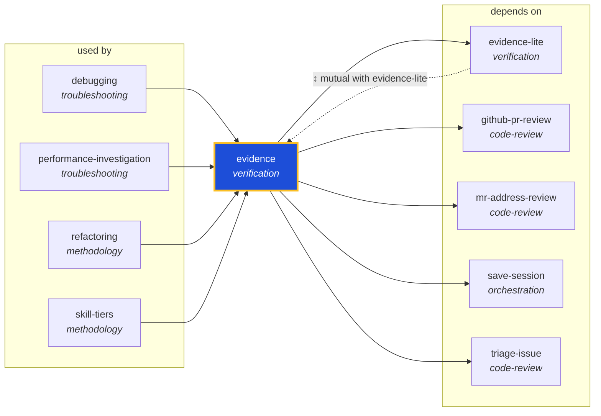

<!-- AUTO-GENERATED by scripts/generate-skills-graph.ts — do not edit by hand. -->
<!-- Regenerate with: npm run graph:update -->

> ⚠️ **AUTO-GENERATED — do not edit this file by hand.**
> Edits will be overwritten. To change the graph, edit the source `SKILL.md` files and run `npm run graph:update`.
> Source: `scripts/generate-skills-graph.ts` · Regenerate: `npm run graph:update`

# evidence

> **Category:** `verification` · **Path:** `skills/verification/evidence/SKILL.md`

Full proof discipline for non-trivial changes. Every claim of done/fixed/passing/verified/green MUST be backed by a real executed command and `.evidence/.../claim.json` validated by `scripts/validate.

## Stats

5 dependencies · 5 dependents

## Graph

Rendered with [Mermaid](https://mermaid.js.org/). On github.com click any node to zoom; drag to pan. If the diagram fails to load, regenerate locally with `npm run graph:update`.

