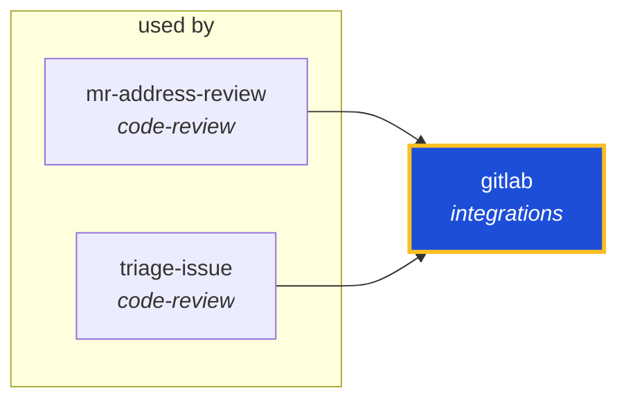

<!-- AUTO-GENERATED by scripts/generate-skills-graph.ts — do not edit by hand. -->
<!-- Regenerate with: npm run graph:update -->

> ⚠️ **AUTO-GENERATED — do not edit this file by hand.**
> Edits will be overwritten. To change the graph, edit the source `SKILL.md` files and run `npm run graph:update`.
> Source: `scripts/generate-skills-graph.ts` · Regenerate: `npm run graph:update`

# gitlab

> **Category:** `integrations` · **Path:** `skills/integrations/gitlab/SKILL.md`

Work with GitLab projects, issues, merge requests, pipelines, and releases. Use when using `glab` CLI, GitLab API endpoints (`gitlab.com`/self-hosted REST/GraphQL), or GitLab MCP tools. NOT for genera

## Stats

0 dependencies · 2 dependents

## Graph

Rendered with [Mermaid](https://mermaid.js.org/). On github.com click any node to zoom; drag to pan. If the diagram fails to load, regenerate locally with `npm run graph:update`.

