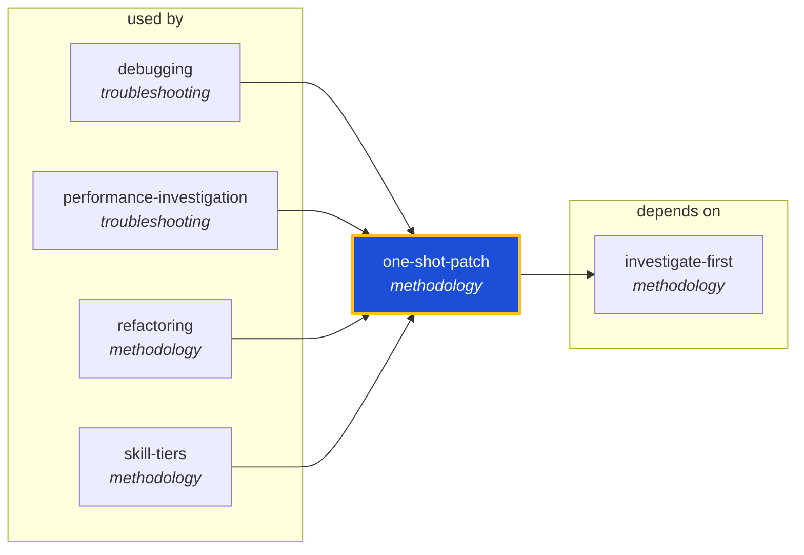

<!-- AUTO-GENERATED by scripts/generate-skills-graph.ts — do not edit by hand. -->
<!-- Regenerate with: npm run graph:update -->

> ⚠️ **AUTO-GENERATED — do not edit this file by hand.**
> Edits will be overwritten. To change the graph, edit the source `SKILL.md` files and run `npm run graph:update`.
> Source: `scripts/generate-skills-graph.ts` · Regenerate: `npm run graph:update`

# one-shot-patch

> **Category:** `methodology` · **Path:** `skills/methodology/one-shot-patch/SKILL.md`

Use when the relevant file and fix hypothesis are known and the agent needs to make exactly one narrow change, then verify it. Prevents stacked fixes, broad refactors, and chaotic iteration. Best for

## Stats

1 dependencies · 4 dependents

## Graph

Rendered with [Mermaid](https://mermaid.js.org/). On github.com click any node to zoom; drag to pan. If the diagram fails to load, regenerate locally with `npm run graph:update`.

