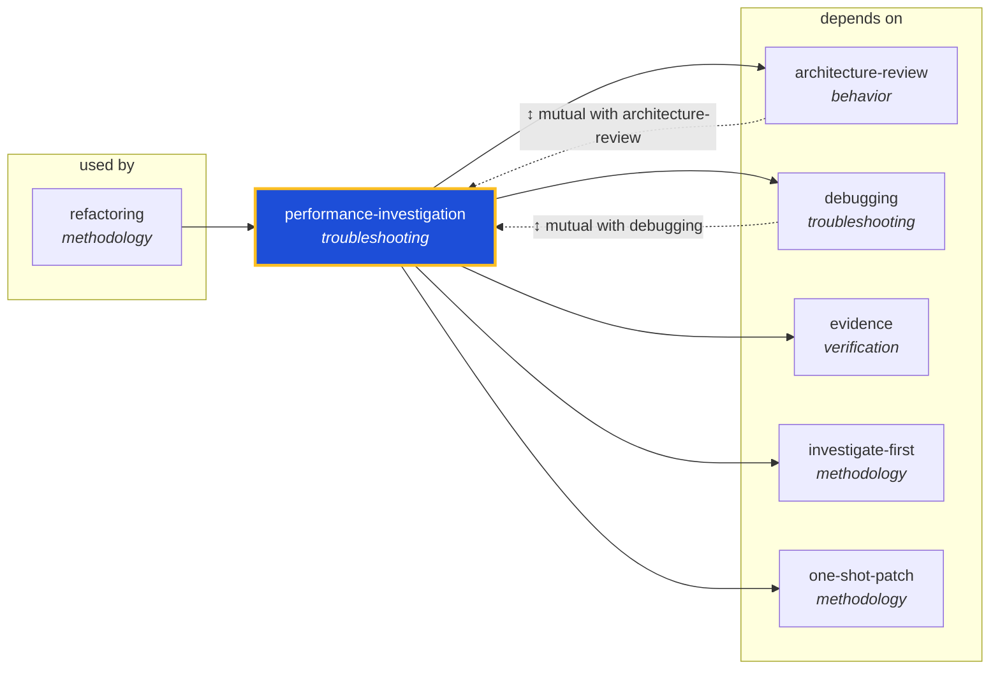

<!-- AUTO-GENERATED by scripts/generate-skills-graph.ts — do not edit by hand. -->
<!-- Regenerate with: npm run graph:update -->

> ⚠️ **AUTO-GENERATED — do not edit this file by hand.**
> Edits will be overwritten. To change the graph, edit the source `SKILL.md` files and run `npm run graph:update`.
> Source: `scripts/generate-skills-graph.ts` · Regenerate: `npm run graph:update`

# performance-investigation

> **Category:** `troubleshooting` · **Path:** `skills/troubleshooting/performance-investigation/SKILL.md`

Use when an agent must analyze a reported or suspected performance problem — slow requests, memory growth, high CPU, long build/test/runtime, query latency, contention, or regressions. Pairs with $ski

## Stats

5 dependencies · 3 dependents

## Graph

Rendered with [Mermaid](https://mermaid.js.org/). On github.com click any node to zoom; drag to pan. If the diagram fails to load, regenerate locally with `npm run graph:update`.

