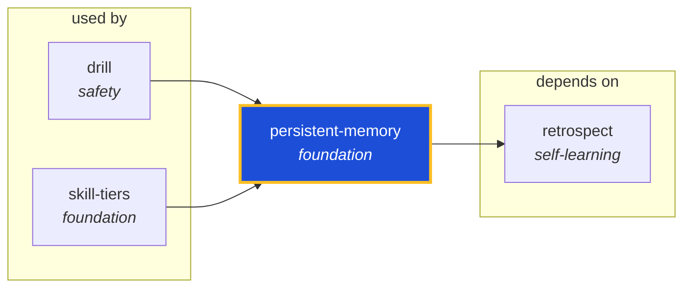

<!-- AUTO-GENERATED by scripts/generate-skills-graph.ts — do not edit by hand. -->
<!-- Regenerate with: npm run graph:update -->

> ⚠️ **AUTO-GENERATED — do not edit this file by hand.**
> Edits will be overwritten. To change the graph, edit the source `SKILL.md` files and run `npm run graph:update`.
> Source: `scripts/generate-skills-graph.ts` · Regenerate: `npm run graph:update`

# persistent-memory

> **Category:** `foundation` · **Path:** `skills/foundation/persistent-memory/SKILL.md`

Persistent memory enforcement for AI agents. Recall prior work and findings before starting a task; persist learnings after completing work. Tier 1 — opt-in via `/recall <terms>` at task start and `/r

## Stats

1 dependencies · 2 dependents

## Graph

Rendered with [Mermaid](https://mermaid.js.org/). On github.com click any node to zoom; drag to pan. If the diagram fails to load, regenerate locally with `npm run graph:update`.

