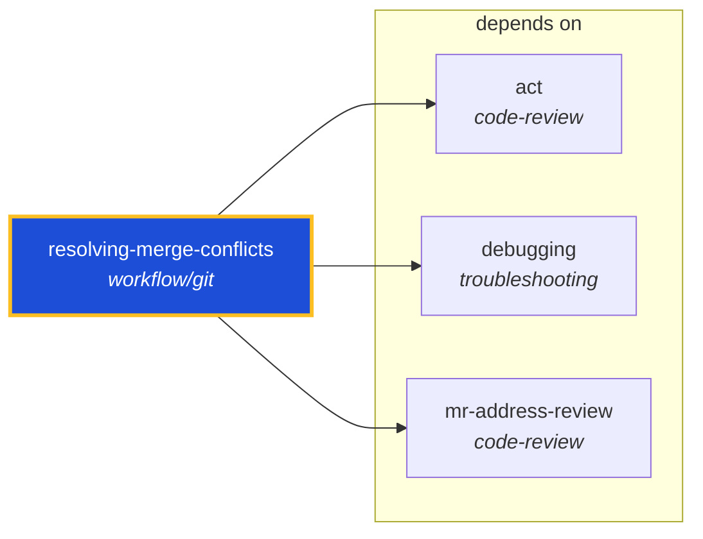

<!-- AUTO-GENERATED by scripts/generate-skills-graph.ts — do not edit by hand. -->
<!-- Regenerate with: npm run graph:update -->

> ⚠️ **AUTO-GENERATED — do not edit this file by hand.**
> Edits will be overwritten. To change the graph, edit the source `SKILL.md` files and run `npm run graph:update`.
> Source: `scripts/generate-skills-graph.ts` · Regenerate: `npm run graph:update`

# resolving-merge-conflicts

> **Category:** `workflow/git` · **Path:** `skills/workflow/git/resolving-merge-conflicts/SKILL.md`

Use when an in-progress `git merge` or `git rebase` has produced conflict markers. Resolves hunks by tracing each side's intent to its primary source (commit message, PR, issue, ticket). Refuses to in

## Stats

3 dependencies · 0 dependents

## Graph

Rendered with [Mermaid](https://mermaid.js.org/). On github.com click any node to zoom; drag to pan. If the diagram fails to load, regenerate locally with `npm run graph:update`.

