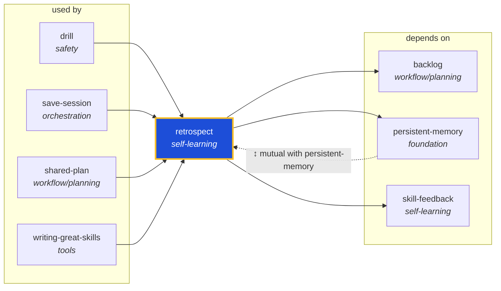

<!-- AUTO-GENERATED by scripts/generate-skills-graph.ts — do not edit by hand. -->
<!-- Regenerate with: npm run graph:update -->

> ⚠️ **AUTO-GENERATED — do not edit this file by hand.**
> Edits will be overwritten. To change the graph, edit the source `SKILL.md` files and run `npm run graph:update`.
> Source: `scripts/generate-skills-graph.ts` · Regenerate: `npm run graph:update`

# retrospect

> **Category:** `self-learning` · **Path:** `skills/self-learning/retrospect/SKILL.md`

Self-correction protocol for AI agents. Use after mistakes, corrections, or when a drill returns a non-trivial finding, then persist the fix and route parallel prevention actions to the right resource

## Stats

3 dependencies · 5 dependents

## Graph

Rendered with [Mermaid](https://mermaid.js.org/). On github.com click any node to zoom; drag to pan. If the diagram fails to load, regenerate locally with `npm run graph:update`.

