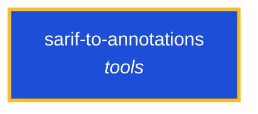

<!-- AUTO-GENERATED by scripts/generate-skills-graph.ts — do not edit by hand. -->
<!-- Regenerate with: npm run graph:update -->

> ⚠️ **AUTO-GENERATED — do not edit this file by hand.**
> Edits will be overwritten. To change the graph, edit the source `SKILL.md` files and run `npm run graph:update`.
> Source: `scripts/generate-skills-graph.ts` · Regenerate: `npm run graph:update`

# sarif-to-annotations

> **Category:** `tools` · **Path:** `skills/tools/sarif-to-annotations/SKILL.md`

Convert SARIF 2.1.0 reports to GitHub Actions workflow-command annotations. Use when a tool already emits SARIF (CodeQL, Snyk, ESLint, Semgrep, Trivy, etc.) and you want inline PR annotations instead

## Stats

0 dependencies · 0 dependents

## Graph

Rendered with [Mermaid](https://mermaid.js.org/). On github.com click any node to zoom; drag to pan. If the diagram fails to load, regenerate locally with `npm run graph:update`.

