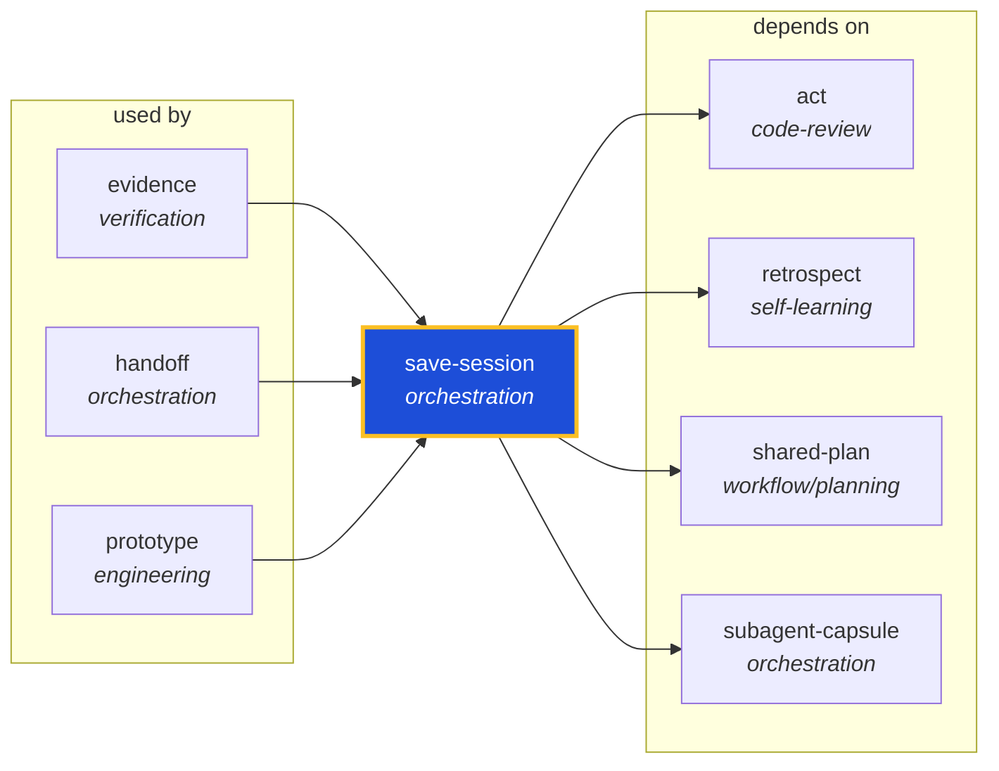

<!-- AUTO-GENERATED by scripts/generate-skills-graph.ts — do not edit by hand. -->
<!-- Regenerate with: npm run graph:update -->

> ⚠️ **AUTO-GENERATED — do not edit this file by hand.**
> Edits will be overwritten. To change the graph, edit the source `SKILL.md` files and run `npm run graph:update`.
> Source: `scripts/generate-skills-graph.ts` · Regenerate: `npm run graph:update`

# save-session

> **Category:** `orchestration` · **Path:** `skills/orchestration/save-session/SKILL.md`

Save work durably when the user says a save-session trigger phrase, or generate a self-contained handoff for the next agent in a PR pipeline. NOT for ordinary git commits, pushes, or memory-only saves

## Stats

4 dependencies · 3 dependents

## Graph

Rendered with [Mermaid](https://mermaid.js.org/). On github.com click any node to zoom; drag to pan. If the diagram fails to load, regenerate locally with `npm run graph:update`.

