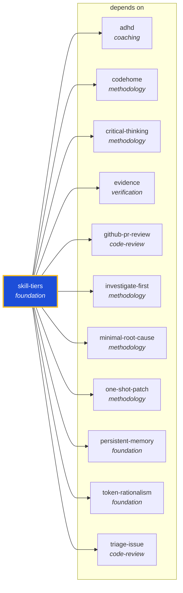

<!-- AUTO-GENERATED by scripts/generate-skills-graph.ts — do not edit by hand. -->
<!-- Regenerate with: npm run graph:update -->

> ⚠️ **AUTO-GENERATED — do not edit this file by hand.**
> Edits will be overwritten. To change the graph, edit the source `SKILL.md` files and run `npm run graph:update`.
> Source: `scripts/generate-skills-graph.ts` · Regenerate: `npm run graph:update`

# skill-tiers

> **Category:** `foundation` · **Path:** `skills/foundation/skill-tiers/SKILL.md`

Skill activation tiers and the 300-line always-on budget. Defines Tier 0 (always-on), Tier 1 (on-task-start via /recall), and Tier 2 (on-demand). Load when deciding which skills to activate or when de

## Stats

11 dependencies · 0 dependents

## Graph

Rendered with [Mermaid](https://mermaid.js.org/). On github.com click any node to zoom; drag to pan. If the diagram fails to load, regenerate locally with `npm run graph:update`.

