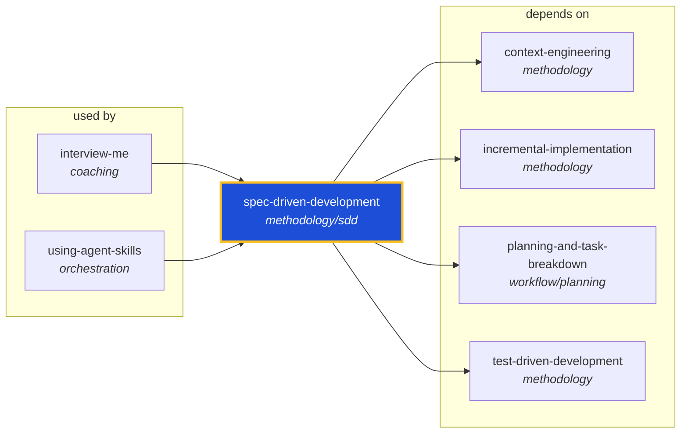

<!-- AUTO-GENERATED by scripts/generate-skills-graph.ts — do not edit by hand. -->
<!-- Regenerate with: npm run graph:update -->

> ⚠️ **AUTO-GENERATED — do not edit this file by hand.**
> Edits will be overwritten. To change the graph, edit the source `SKILL.md` files and run `npm run graph:update`.
> Source: `scripts/generate-skills-graph.ts` · Regenerate: `npm run graph:update`

# spec-driven-development

> **Category:** `methodology/sdd` · **Path:** `skills/methodology/sdd/spec-driven-development/SKILL.md`

Creates specs before coding. Use when starting a new project, feature, or significant change and no specification exists yet. Use when requirements are unclear, ambiguous, or only exist as a vague ide

## Stats

4 dependencies · 2 dependents

## Graph

Rendered with [Mermaid](https://mermaid.js.org/). On github.com click any node to zoom; drag to pan. If the diagram fails to load, regenerate locally with `npm run graph:update`.

