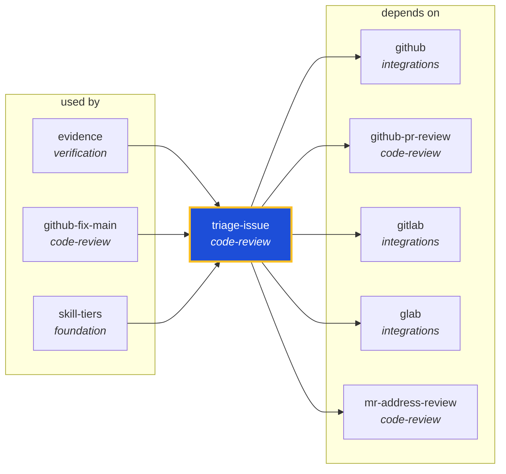

<!-- AUTO-GENERATED by scripts/generate-skills-graph.ts — do not edit by hand. -->
<!-- Regenerate with: npm run graph:update -->

> ⚠️ **AUTO-GENERATED — do not edit this file by hand.**
> Edits will be overwritten. To change the graph, edit the source `SKILL.md` files and run `npm run graph:update`.
> Source: `scripts/generate-skills-graph.ts` · Regenerate: `npm run graph:update`

# triage-issue

> **Category:** `code-review` · **Path:** `skills/code-review/triage-issue/SKILL.md`

Triage a GitLab or GitHub issue end-to-end — acknowledge, investigate, fix or retest, verify, and report back on the issue. Use when the user asks to triage an issue/work item, says "/triage-issue", o

## Stats

5 dependencies · 3 dependents

## Graph

Rendered with [Mermaid](https://mermaid.js.org/). On github.com click any node to zoom; drag to pan. If the diagram fails to load, regenerate locally with `npm run graph:update`.

