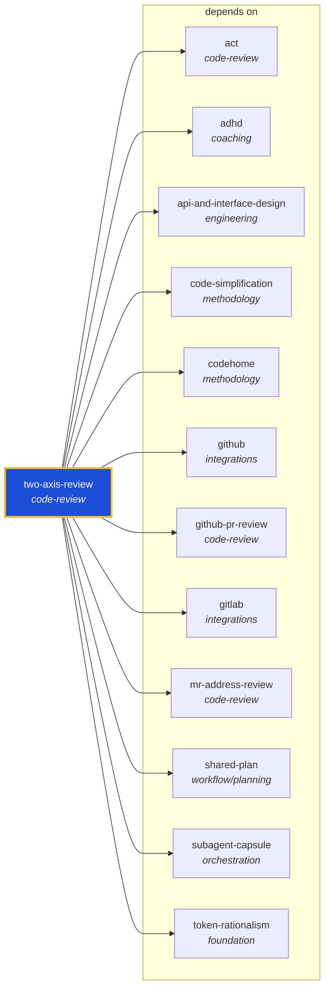

<!-- AUTO-GENERATED by scripts/generate-skills-graph.ts — do not edit by hand. -->
<!-- Regenerate with: npm run graph:update -->

> ⚠️ **AUTO-GENERATED — do not edit this file by hand.**
> Edits will be overwritten. To change the graph, edit the source `SKILL.md` files and run `npm run graph:update`.
> Source: `scripts/generate-skills-graph.ts` · Regenerate: `npm run graph:update`

# two-axis-review

> **Category:** `code-review` · **Path:** `skills/code-review/two-axis-review/SKILL.md`

Review the changes since a fixed point (commit, branch, tag, or merge-base) along two independent axes — Standards (does the code follow the repo's documented coding standards plus a Fowler smell base

## Stats

12 dependencies · 0 dependents

## Graph

Rendered with [Mermaid](https://mermaid.js.org/). On github.com click any node to zoom; drag to pan. If the diagram fails to load, regenerate locally with `npm run graph:update`.

