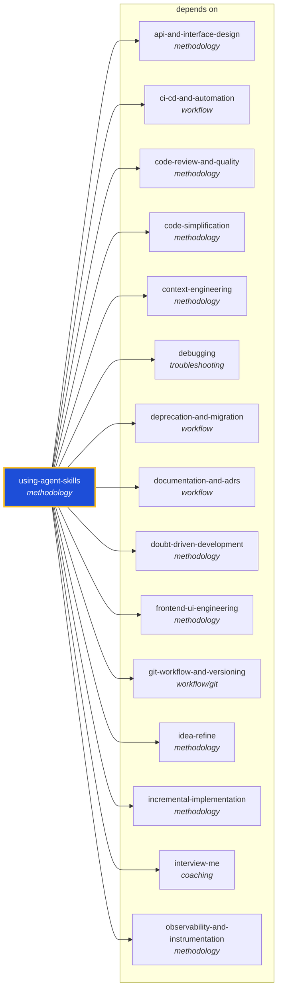

<!-- AUTO-GENERATED by scripts/generate-skills-graph.ts — do not edit by hand. -->
<!-- Regenerate with: npm run graph:update -->

> ⚠️ **AUTO-GENERATED — do not edit this file by hand.**
> Edits will be overwritten. To change the graph, edit the source `SKILL.md` files and run `npm run graph:update`.
> Source: `scripts/generate-skills-graph.ts` · Regenerate: `npm run graph:update`

# using-agent-skills

> **Category:** `methodology` · **Path:** `skills/methodology/using-agent-skills/SKILL.md`

Discovers and invokes agent skills. Use when starting a session or when you need to discover which skill applies to the current task. This is the meta-skill that governs how all other skills are disco

## Stats

22 dependencies · 0 dependents
_graph truncated: 22 deps (showing 15)_

## Graph

Rendered with [Mermaid](https://mermaid.js.org/). On github.com click any node to zoom; drag to pan. If the diagram fails to load, regenerate locally with `npm run graph:update`.

