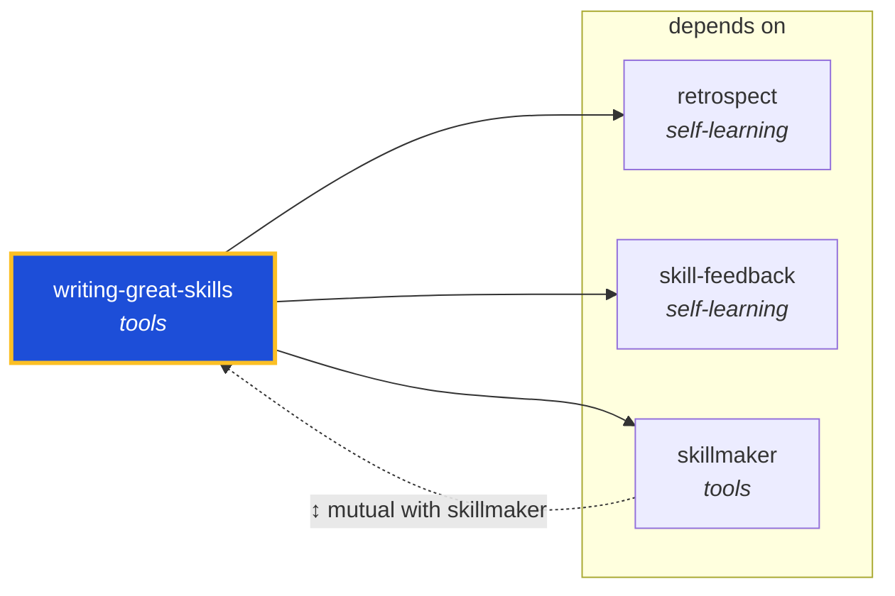

<!-- AUTO-GENERATED by scripts/generate-skills-graph.ts — do not edit by hand. -->
<!-- Regenerate with: npm run graph:update -->

> ⚠️ **AUTO-GENERATED — do not edit this file by hand.**
> Edits will be overwritten. To change the graph, edit the source `SKILL.md` files and run `npm run graph:update`.
> Source: `scripts/generate-skills-graph.ts` · Regenerate: `npm run graph:update`

# writing-great-skills

> **Category:** `tools` · **Path:** `skills/tools/writing-great-skills/SKILL.md`

Reference for writing and editing skills well — the vocabulary and principles that make a skill predictable. Use when authoring a new skill, reviewing a skill for retirement or merge, or debugging a s

## Stats

3 dependencies · 1 dependents

## Graph

Rendered with [Mermaid](https://mermaid.js.org/). On github.com click any node to zoom; drag to pan. If the diagram fails to load, regenerate locally with `npm run graph:update`.

